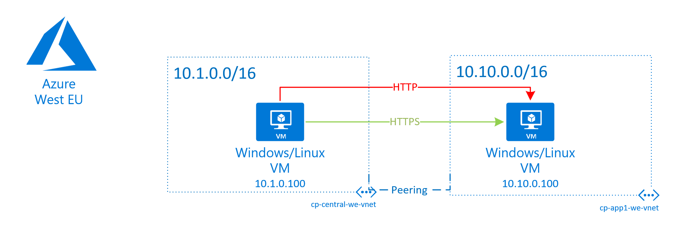
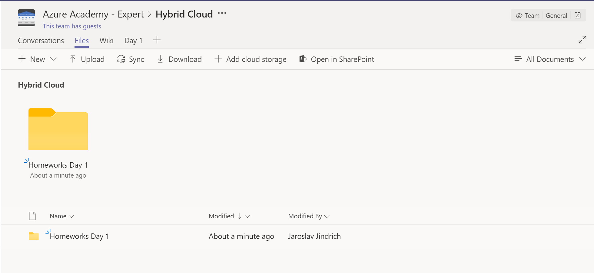

# Homework from Hybrid Day 1

Deadline: September 1st 2019

Tasks

1. Create resource group named with your name !
2. Create infrastructure deployment based on schema with your unique vm prefix
3. Configure NSG to allow HTTPS and deny HTTP 
4. Configure monitoring CPU etc
5. Configure network Connection monitor to monitor HTTP and HTTPS
6. Configure monitoring to monitor IIS/nginx process CPU consumption
7. Configure backup

Schema
 

Output

1. Screenshot of all resources in your resource group
2. Topology screenshot from Azure Monitor -> Network -> Network Watcher -> Topology
3. Network monitor screenshot to show HTTP is down and HTTPS is up
4. Azure Backup screenshot to show available restore points
5. Azure Monitor screenshot to show monitored process in time CPU consumption

**Compress this output and save it into Azure Academy Teams folder and post new message you did your homework**

